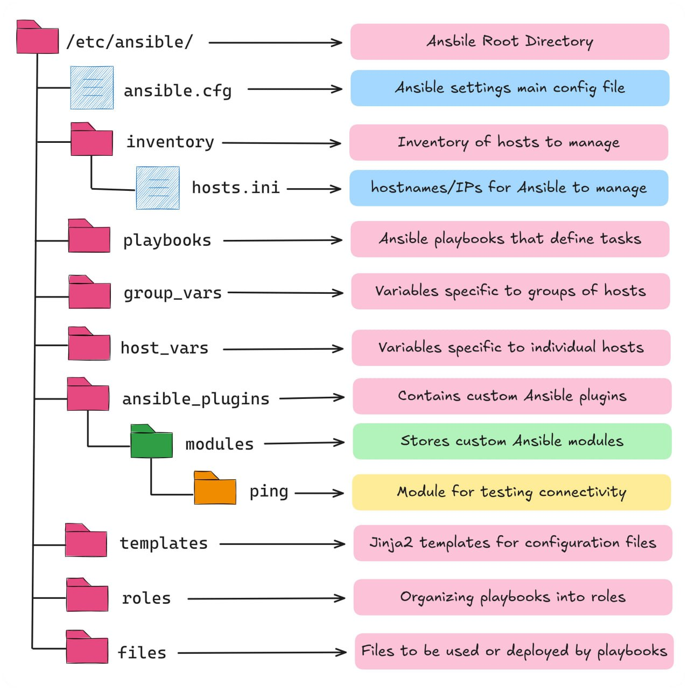

### 📁 Ansible Project Structure




---

#### `init.yml`  
An initialization playbook — typically used to prepare a base environment or set up common prerequisites.
```bash
ansible-playbook init.yml
```

---

#### `.gitignore`  
Specifies which files/folders should be ignored by version control (Git).

